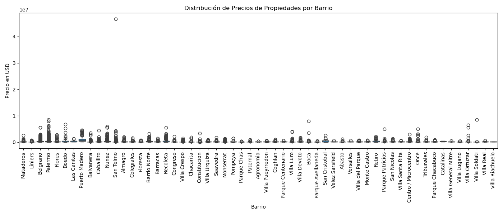
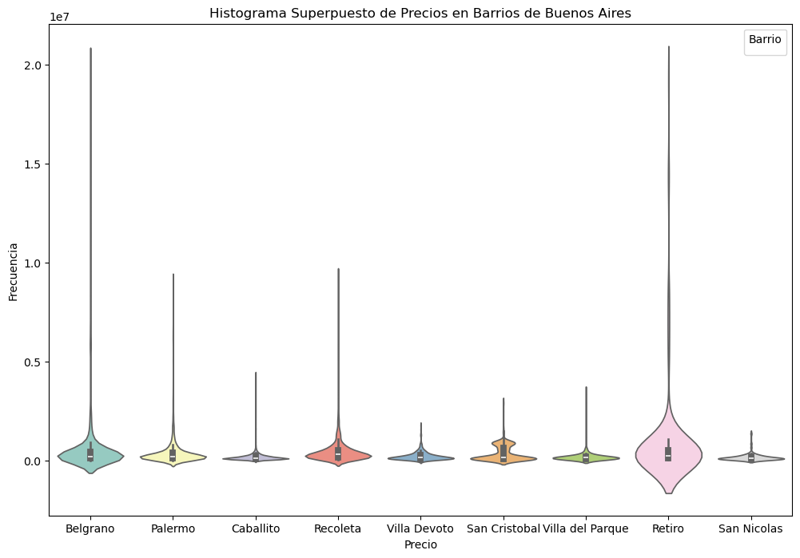
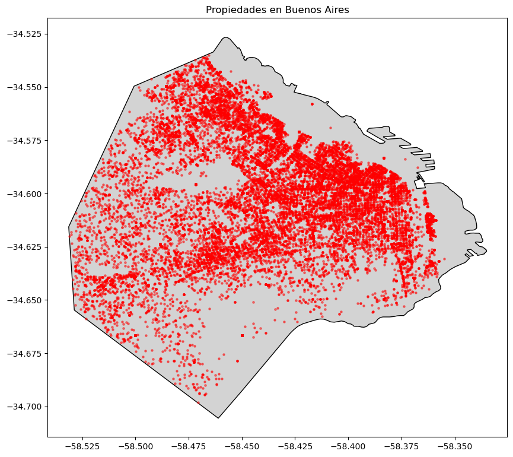

# Property Prices Analysis - Argentina

This repository contains data analysis and predictive modeling notebooks focused on property prices in Argentina, with a special focus on the City of Buenos Aires. The project is divided into two main parts:

---

## Project Structure

- **part 1.ipynb**  
  Exploratory Data Analysis (EDA) and data cleaning. Includes handling missing values, feature engineering, and geospatial enrichment of the property dataset.

- **part 2.ipynb**  
  Predictive modeling using linear regression and regularized models (Lasso, Ridge). Includes feature scaling, one-hot encoding, and model evaluation.

- **test_Buenos-Aires.ipynb**  
  Visualization notebook focused on the City of Buenos Aires. Includes price distribution by barrio (neighborhood) and geospatial plots of property locations.

---

## Part 1: Exploratory Data Analysis (EDA)

- **Objective:** Understand and clean the property price dataset.
- **Key Tasks:**
  - Handling missing data
  - Generating descriptive statistics
  - Feature engineering (surface, rooms, amenities, geolocation)
  - Data visualization

---

## Part 2: Predictive Modeling

- **Objective:** Build and evaluate models to predict property prices.
- **Key Tasks:**
  - Data preprocessing and feature scaling
  - One-hot encoding of categorical variables
  - Train-test data splitting
  - Model training (Linear Regression, Lasso, Ridge)
  - Model evaluation and interpretation

---

## Visualizations

Below are some preview plots generated in [`test_Buenos-Aires.ipynb`](test_Buenos-Aires.ipynb):

### Distribución de Precios de Propiedades por Barrio

### Distribución de Precios (Histograma)

### Mapa de Propiedades en la Ciudad de Buenos Aires

---

## Data Sources

- **Property Data:** `tp2_properati_no_input.csv`
- **Geographical Data:**
  - Shapefiles and administrative boundaries in `provincias/`
  - Gazetteer and metadata in `provincias/AR/`

---

## Technologies

- Python
- Pandas
- NumPy
- Seaborn
- Matplotlib
- GeoPandas
- Scikit-Learn
- StatsModels

---

## How to Run

1. Clone this repository.
2. Install dependencies (see requirements in the notebooks).
3. Run the notebooks in order:
   - [`part 1.ipynb`](part%201.ipynb)
   - [`part 2.ipynb`](part%202.ipynb)
   - [`test_Buenos-Aires.ipynb`](test_Buenos-Aires.ipynb) for visualizations.

---

## Authors

- [Your Name(s)]

---

## License

This project is licensed under the MIT License.
