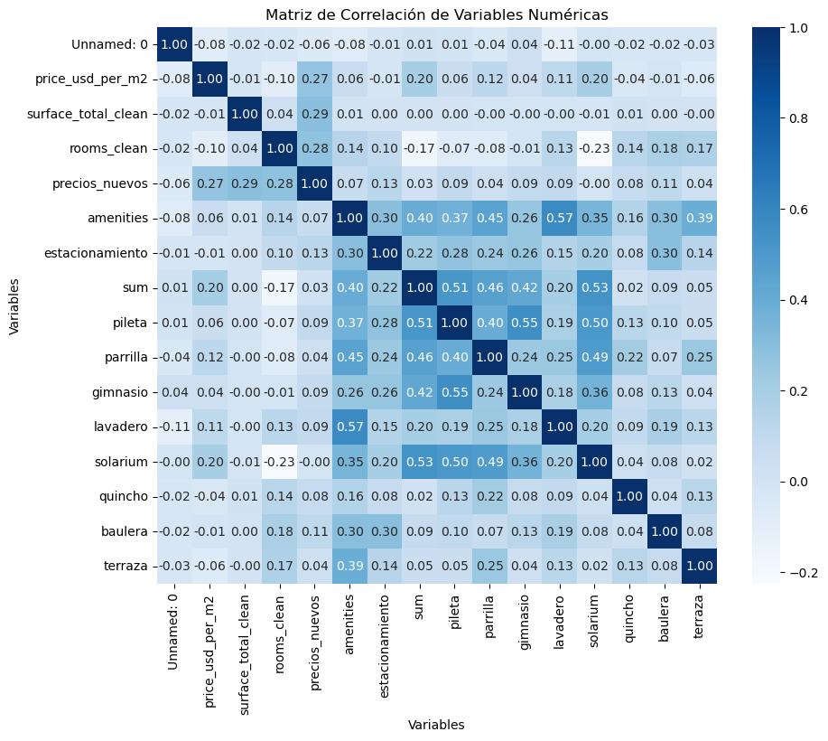
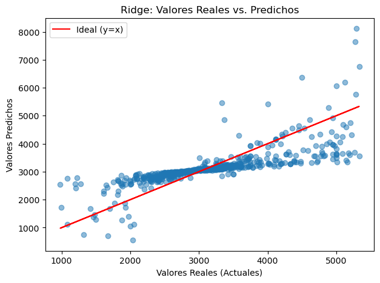
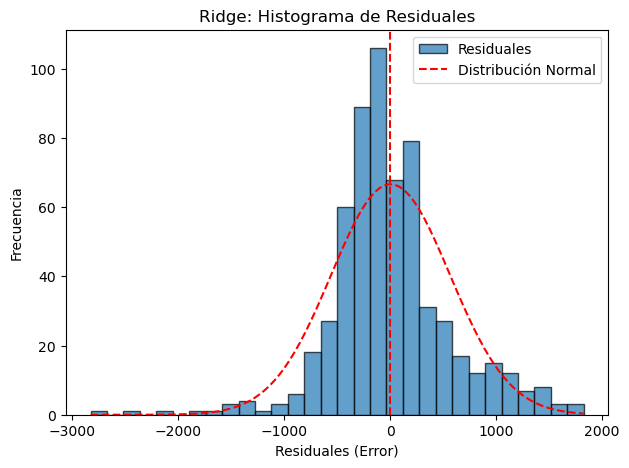
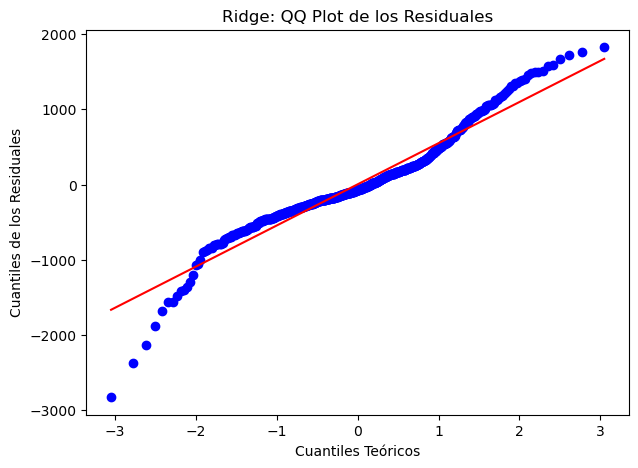

# Property Prices Analysis - Argentina

This repository contains data analysis and predictive modeling notebooks focused on property prices in Argentina, with a special focus on the City of Buenos Aires. The project is divided into two main parts:

---

## Project Structure

- **part 1.ipynb**  
  Exploratory Data Analysis (EDA) and data cleaning. Includes handling missing values, feature engineering, and geospatial enrichment of the property dataset.

- **part 2.ipynb**  
  Predictive modeling using linear regression and regularized models (Lasso, Ridge). Includes feature scaling, one-hot encoding, and model evaluation.

- **test_Buenos-Aires.ipynb**  
  Visualization notebook focused on the City of Buenos Aires. Includes price distribution by barrio (neighborhood) and geospatial plots of property locations.

---

## Part 1: Exploratory Data Analysis (EDA)

- **Objective:** Understand and clean the property price dataset.
- **Key Tasks:**
  - Handling missing data
  - Generating descriptive statistics
  - Feature engineering (surface, rooms, amenities, geolocation)
  - Data visualization

---

## Part 2: Predictive Modeling

- **Objective:** Build and evaluate models to predict property prices.
- **Key Tasks:**
  - Data preprocessing and feature scaling
  - One-hot encoding of categorical variables
  - Train-test data splitting
  - Model training (Linear Regression, Lasso, Ridge)
  - Model evaluation and interpretation

---

## Visualizations

- **Geospatial Property Map**  
    
  _Visualizes the geographic distribution of properties in the city, highlighting spatial price patterns._

- **Correlation Matrix Heatmap**  
    
  _Shows the correlation between numerical variables in the dataset. Useful for identifying relationships and multicollinearity._

- **Price Distribution by Neighborhood**  
    
  _Displays the distribution of property prices per square meter across different neighborhoods in Buenos Aires._

- **Actual vs. Predicted Values (Ridge Regression)**  
    
  _This scatter plot compares the predicted property prices to the actual prices for the test set. The closer the points are to the red diagonal line, the better the model's predictions._

- **Histogram of Residuals (Ridge Regression)**  
     
   _Shows the distribution of prediction errors (residuals). A symmetric, bell-shaped histogram centered at zero indicates that the model errors are approximately normally distributed, which is a desirable property for linear regression._

- **QQ Plot of Residuals (Ridge Regression)**  
     
   _Compares the distribution of residuals to a normal distribution. If the points fall along the reference line, the residuals are normally distributed, supporting the assumptions of linear regression._

---

## Data Sources

- **Property Data:** `tp2_properati_no_input.csv`
- **Geographical Data:**
  - Shapefiles and administrative boundaries in `provincias/`
  - Gazetteer and metadata in `provincias/AR/`

---

## Technologies

- Python
- Pandas
- NumPy
- Seaborn
- Matplotlib
- GeoPandas
- Scikit-Learn
- StatsModels

---

## How to Run

1. Clone this repository.
2. Install dependencies (see requirements in the notebooks).
3. Run the notebooks in order:
   - [`part 1.ipynb`](part%201.ipynb)
   - [`part 2.ipynb`](part%202.ipynb)
   - [`test_Buenos-Aires.ipynb`](test_Buenos-Aires.ipynb) for visualizations.

---

## Authors

- Juan S. Vassallo

---

## License

This project is for educational purposes only
